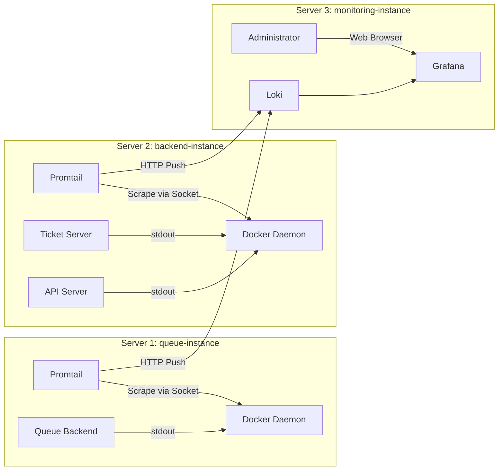

# 로깅 시스템 구축 및 운영 가이드 (Logging Service)

## 1. 도입 배경 및 설계 철학 (Why & Philosophy)

### 1.1. 문제 상황 (As-Is)
*   **분산된 환경:** 물리 서버 2대(`queue-instance`, `backend-instance`)에 걸쳐 3개의 애플리케이션(`api`, `ticket`, `queue`)이 분산 구동됨.
*   **확인의 어려움:** 로그를 보려면 각 서버에 SSH로 접속해 `docker logs`를 쳐야 함.
*   **실시간성 부재:** 티켓팅 오픈(13:00:00) 순간, 시스템이 정상적으로 열렸는지, 트래픽이 들어오는지 한눈에 파악할 수 없음.

### 1.2. 해결 목표 (To-Be)
*   **단일 접점(Single Pane of Glass):** 모든 서버의 로그를 웹 대시보드 하나에서 조회.
*   **비즈니스 가시성:** "로그"를 단순 텍스트가 아닌 "데이터"로 취급하여 필터링 및 분석 가능하게 함.
*   **운영 안정성:** 로깅 시스템이 죽어도 비즈니스 로직에는 전혀 영향을 주지 않아야 함.

### 1.3. 아키텍처 결정 이유 (Architecture Decision Records)
1.  **스택 선정 (PLG Stack):**
    *   `Promtail` + `Loki` + `Grafana` 조합 선택.
    *   **이유:** ELK(Elasticsearch) 대비 리소스 소모가 적고, 설정이 간편하며, Docker 환경에 최적화됨.
2.  **물리적 격리:**
    *   모니터링 시스템(Loki/Grafana)을 **제3의 독립 서버(monitoring-instance)**에 구축.
    *   **이유:** 티켓팅 트래픽 폭주로 메인 서버가 뻗어도, 로그 서버는 살아서 "왜 뻗었는지"를 기록해야 함.
3.  **수집 방식 (Docker Socket vs File Mount):**
    *   **Docker API (`/var/run/docker.sock`)** 방식 채택.
    *   **이유:** OS 환경(Ubuntu, CentOS)이나 설치 방식(Snap, Docker Desktop)에 구애받지 않고 가장 안정적으로 로그를 수집할 수 있음.

---

## 2. 시스템 아키텍처 (System Architecture)

### 2.1. 구성도



### 2.2. 로그 파이프라인 (Log Pipeline)
1.  **Format (App):** NestJS `Winston` 로거가 JSON 형식으로 출력.
    *   `{"service":"api-server", "level":"info", "message":"Ticketing opened", "timestamp":"..."}`
2.  **Collect (Promtail):** Docker Socket에서 Raw Stream 수집.
3.  **Process (Promtail Pipeline):**
    *   `docker_sd_configs`: 컨테이너 자동 감지.
    *   `json`: 이중 JSON 해제 (Docker 껍데기 제거).
    *   `labels`: `service`, `level`, `host` 라벨 자동 부착.
    *   `timestamp`: 로그 발생 시각으로 동기화 (`RFC3339`).
4.  **Store (Loki):** 라벨 기반 인덱싱 및 저장 (14일 보관).

---

## 3. 설정 상세 (Configuration Details)

### 3.1. 애플리케이션 공통 설정 (`packages/backend-config`)
*   모든 마이크로서비스는 `getWinstonLogger(serviceName)` 함수를 사용하여 로거를 초기화함.
*   이를 통해 로그 포맷(`json`)과 타임스탬프 형식을 강제로 통일함.

### 3.2. Promtail 설정 (`promtail-config.yaml`)
*   **`clients`**: `${LOKI_URL}` 환경 변수를 통해 유동적으로 목적지 설정.
*   **`scrape_configs`**:
    *   `job_name: docker`
    *   `host`: `unix:///var/run/docker.sock`
*   **`relabel_configs`**:
    *   `host`: 각 물리 서버별 고유 ID (`queue-instance`, `backend-instance`) 부여.

### 3.3. Loki 설정 (`loki-config.yaml`)
*   **`reject_old_samples: false`**: 네트워크 지연이나 과거 로그 재수집 시 데이터 유실 방지.
*   **`retention_period: 336h`**: 디스크 용량 관리를 위해 2주 지난 로그 자동 삭제.

---

## 4. 배포 및 운영 가이드 (Operation Guide)

### 🚨 4.1. 배포 전 필수 준비 사항 (CRITICAL)
각 애플리케이션 서버(`queue-instance`, `backend-instance`)의 **`.env` 파일에 모니터링 서버 주소를 반드시 설정해야 합니다.** 설정하지 않으면 로그가 전송되지 않습니다.

```bash
# -----------------------------------------------------
# [중요] 모니터링 서버(monitoring-instance) 연결 설정
# - IP: monitoring-instance의 공인 IP 또는 사설 IP
# - Port: 3100 (Loki 수집 포트)
# -----------------------------------------------------
LOKI_URL=http://[MONITORING_INSTANCE_IP]:3100/loki/api/v1/push
```

### 4.2. 배포 및 실행 순서 (Deployment Strategy)

안정적인 로그 수집을 위해 **모니터링 서버를 먼저 구축하고, 그 다음에 애플리케이션 서버를 배포**하는 순서를 권장합니다.

#### Step 1: 모니터링 서버 (`monitoring-instance`) 선행 구축
*   **방식:** 수동 배포 (Manual Deployment) 권장.
    *   **이유:** 모니터링 시스템은 애플리케이션 배포 주기와 무관하게 **항상 실행 중(Always Up)**이어야 하며, 설정 변경이 잦지 않기 때문입니다.
*   **절차:**
    1.  서버에 SSH 접속 및 Git/Docker 설치.
    2.  `git pull` 또는 `monitoring/` 폴더 전송.
    3.  `docker compose -f monitoring/docker-compose.yml up -d` 실행.
    4.  **IP 확보:** 해당 서버의 IP 주소를 확인하여 `LOKI_URL`을 생성합니다. (`http://[IP]:3100/...`)

#### Step 2: 애플리케이션 서버 (`queue`, `backend`) 후행 배포
*   **방식:** CI/CD 파이프라인.
*   **절차:**
    1.  각 서버의 운영 환경 변수(`.env`)에 위에서 확보한 `LOKI_URL`을 주입합니다.
    2.  배포 파이프라인을 실행합니다.
    3.  컨테이너가 뜨는 즉시 Promtail이 실행되어, 이미 살아있는 Loki로 초기화 로그를 전송합니다.

> **💡 참고:** 만약 애플리케이션을 먼저 배포하면 Promtail이 Loki를 찾지 못해 에러 로그(`connection refused`)를 뿜으며 재시작을 반복합니다. (서비스 동작에는 영향 없으나 로그 수집 불가)

### 4.3. 로그 조회 및 활용 (Grafana Explore)

Grafana URL: `http://monitor.web10.site` (또는 `http://[IP]:3004`)

#### 상황 A: "지금 티켓팅 서버 잘 돌아가나?" (전체 흐름 확인)
*   **Query:** `{host="backend-instance"}`
*   **Action:** 우측 상단 **"Live"** 버튼 클릭.
*   **Result:** `api-server`와 `ticket-server`의 로그가 실시간으로 흐르는 것을 육안 확인.

#### 상황 B: "특정 유저가 결제 실패했다고 함" (트러블슈팅)
*   **Query:** `{job="docker"} |= "user_id_123"`
*   **Result:** 3개의 서버(`Queue` -> `API` -> `Ticket`)를 넘나드는 해당 유저의 모든 트래픽 로그가 시간순으로 정렬되어 출력됨.

#### 상황 C: "에러만 모아보고 싶음"
*   **Query:** `{level="error"}`
*   **Result:** 전체 시스템에서 발생한 Error 로그만 필터링.

---

## 5. 유지보수 및 주의사항

1.  **권한 문제:** Promtail 컨테이너는 반드시 `user: root` 권한으로 실행되어야 함 (`/var/run/docker.sock` 접근용).
2.  **시간 동기화 (NTP):** 모든 물리 서버의 시간이 동기화되어 있어야 로그 순서가 꼬이지 않음 (`sudo timedatectl status` 확인 권장).
3.  **방화벽:** `monitoring-instance`의 `3100`(Loki Inbound) 포트는 애플리케이션 서버들의 IP에 대해 열려 있어야 함.